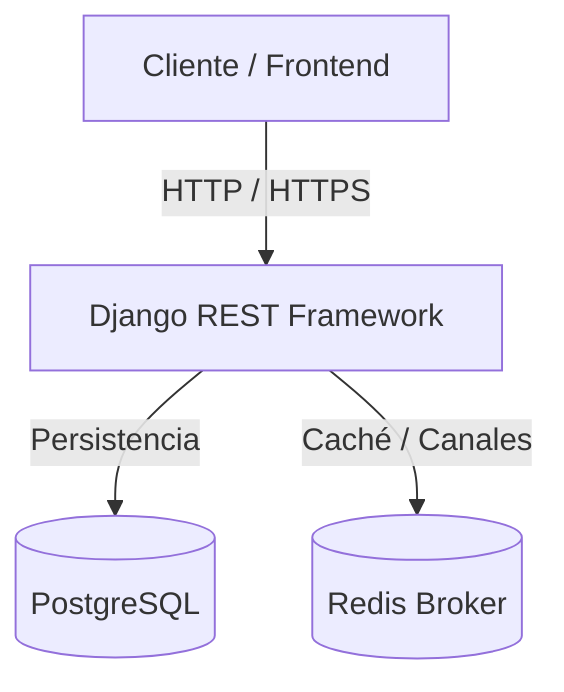

# 🚀 Wback - Messaging Backend API

[](https://www.python.org/)
[](https://www.djangoproject.com/)
[](https://www.postgresql.org/)
[](https://www.docker.com/)
[](https://redis.io/)

**Wback** es una API REST segura, contenerizada y de alto rendimiento diseñada como el motor backend para aplicaciones de mensajería y chat en tiempo real. Construido sobre **Python**, **Django** y **Django REST Framework (DRF)**, provee una arquitectura sólida para la gestión de usuarios, sesiones seguras mediante JWT y flujos de mensajería escalables.

---

## 🗺️ Arquitectura del Sistema

El siguiente diagrama ilustra el flujo de componentes y servicios que componen el ecosistema de **Wback**:



---

## ✨ Características Principales

- 🔐 **Autenticación Robusta:** Flujo seguro con **JWT** (JSON Web Tokens) usando `djangorestframework-simplejwt`.
- 👤 **Gestión de Perfiles Avanzada:** Modelo de usuario personalizado con inicio de sesión por correo electrónico, carga de avatares (imágenes de perfil), números de teléfono y panel personalizable (`/me`).
- 📝 **Documentación Interactiva:** Esquema OpenAPI 3.0 dinámico visualizable a través de **Swagger UI** y **Redoc** (`drf-spectacular`).
- 🐳 **Entorno Contenerizado:** Listo para producción y desarrollo local con **Docker** y **Docker Compose**.
- ⚡ **Herramientas de Última Generación:** Gestión de paquetes y dependencias ultra-rápida con **`uv`**.
- 🔄 **Mensajería & Notificaciones:** Canales preparados para integración en tiempo real respaldados por **Redis**.

---

## 🛠️ Stack Tecnológico

| Componente | Tecnología | Propósito |
| :--- | :--- | :--- |
| **Backend** | Python 3.12+ / Django 5.2 | Framework Web de alto rendimiento |
| **API Engine** | Django REST Framework | Creación y serialización de endpoints REST |
| **Base de Datos** | PostgreSQL 15 | Almacenamiento relacional robusto |
| **Broker/Cache** | Redis | Gestión de colas, caché y mensajería |
| **Gestor de Paquetes**| `uv` (Astraea/Astral) | Resolución ultrarrápida de dependencias |
| **Contenerización** | Docker / Docker Compose | Consistencia de entornos y despliegue rápido |

---

## 📁 Estructura del Proyecto

```bash
wback/
├── apps/
│   ├── users/          # Registro, Login, Gestión de perfil (/me) y Cambio de contraseñas.
│   ├── message/        # (Base) Canales de chat, envío de mensajes y salas.
│   ├── notifications/  # (Base) Alertas y push notifications.
│   └── utils/          # Helpers y utilidades compartidas.
├── wback/
│   ├── settings.py     # Configuraciones globales del proyecto.
│   └── urls.py         # Enrutamiento general de endpoints y docs.
```

---

## 🛣️ Catálogo de Endpoints (API Reference)

### Autenticación y Registro
*   `POST /api/users/register/` - Registra un nuevo usuario en la plataforma.
*   `POST /api/users/login/` - Inicia sesión y devuelve los tokens JWT (`access` y `refresh`).
*   `POST /api/users/token/refresh/` - Renueva el token de acceso JWT expirado usando el refresh token.
*   `POST /api/users/change-password/` 🔒 - Permite cambiar la contraseña del usuario autenticado.

### Perfil del Usuario
*   `GET /api/users/me/` 🔒 - Obtiene la información del perfil del usuario autenticado.
*   `PATCH /api/users/me/` 🔒 - Actualiza de forma parcial los datos del perfil (nombre, teléfono, foto, etc.).

### Administración (Solo Administradores 🛡️)
*   `GET /api/users/` 🔒 - Listado de todos los usuarios registrados.
*   `GET /api/users/{id}/` 🔒 - Información detallada de un usuario por ID.
*   `PUT/PATCH /api/users/{id}/` 🔒 - Edición completa o parcial de un usuario por ID.
*   `DELETE /api/users/{id}/` 🔒 - Elimina permanentemente a un usuario por ID.

### Documentación e Interfaces
*   `GET /api/docs/` - Documentación interactiva con **Swagger UI**.
*   `GET /api/redoc/` - Documentación limpia con **Redoc**.
*   `GET /api/schema/` - Descarga del archivo YAML de especificación OpenAPI.

*Nota: Los endpoints marcados con 🔒 requieren el header `Authorization: Bearer <access_token>`.*

---

## 📦 Guía de Instalación y Uso

### Variables de Entorno
Crea un archivo `.env` en la raíz del proyecto tomando como referencia el archivo `envSample`:
```bash
cp envSample .env
```

Ajusta los valores de base de datos, claves secretas y contraseñas de Redis según sea necesario.

### Opción A: Ejecutar con Docker (Recomendado)
Asegúrate de tener instalados **Docker** y **Docker Compose**.

1. **Construir y levantar contenedores:**
   ```bash
   docker compose up --build
   ```
2. **Aplicar migraciones automáticas (en otra pestaña):**
   ```bash
   docker compose exec wback python manage.py migrate
   ```
3. **Crear un superusuario de pruebas (Admin):**
   ```bash
   docker compose exec wback python manage.py createsuperuser
   ```
4. **Acceder a la API:**
   - Documentación interactiva: [http://localhost:8000/api/docs/](http://localhost:8000/api/docs/)
   - Consola de Administración: [http://localhost:8000/admin/](http://localhost:8000/admin/)

---

### Opción B: Ejecución Local (con `uv`)
Si prefieres ejecutarlo nativamente sin contenedores:

1. **Instalar dependencias y sincronizar entorno:**
   ```bash
   uv sync
   ```
2. **Aplicar migraciones:**
   ```bash
   uv run wback/manage.py migrate
   ```
3. **Crear un superusuario:**
   ```bash
   uv run wback/manage.py createsuperuser
   ```
4. **Iniciar el servidor de desarrollo:**
   ```bash
   uv run wback/manage.py runserver
   ```

